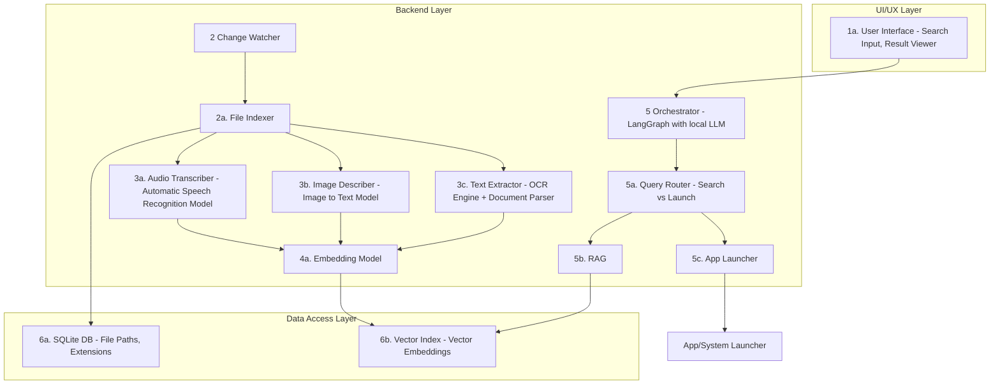

# AI File Finder

This system aims to make file search easier in your system enabling Natural Language based file search, Software launching and content context based file search.

## High level Architecture diagram

## Currently implemented features:
- Real time file tracking as a background service (Monitors create, rename and delete new files)
- Automatic rule based exclusion of system directories and temp files to reduce noise
- File events storage in an indexed db
